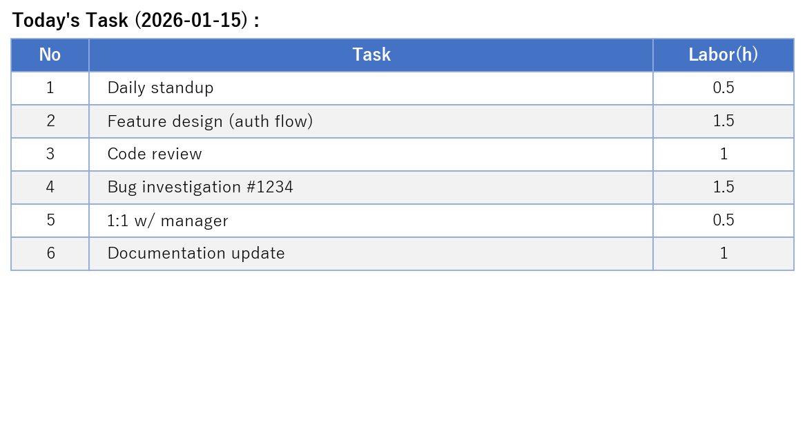
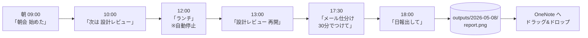
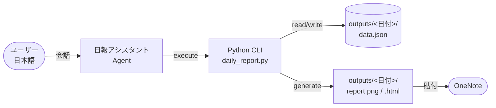

# Daily Report Agent

日本語で話しかけると **タスク時間を計測 → 日報(OneNote 用 PNG/HTML)を生成** してくれる、GitHub Copilot 用エージェント。

下記が出力例です。



## なにができるの?

### 主な機能(発話 → エージェントの動作)

| 機能 | 発話例 | 裏で動く CLI |
|---|---|---|
| タスク開始 | 「Training 始めた」 | `start "Training"` |
| タスク切替(前を自動停止) | 「次は 1on1 w/田中さん」 | `switch "1on1 w/田中さん"` |
| タスク再開(時間が累積) | 「Onboarding をまた再開」 | `start "Onboarding"`(同名で OK) |
| 状況確認 | 「いま何してる」 | `status` |
| 手動で時間を加算 | 「メール仕分け 30分でつけて」 | `add "メール仕分け" 0.5` |
| 時間を上書き | 「No 5 を 1.5 時間に直して」 | `edit 5 1.5` |
| タスク名を変更 | 「No 5 の名前を 設計レビュー に」 | `rename 5 "設計レビュー"` |
| タスクを削除 | 「No 3 を消して」 | `remove 3` |
| 日報出力(PNG / HTML) | 「終わり、日報出して」 | `report` |

### 1 日の流れ



### 全体の流れ



時間は 0.5h 単位で四捨五入され、**1 日 = 1 フォルダ** で全部入りで保存されます。

---

## 構成

公式 [Custom Agents](https://code.visualstudio.com/docs/copilot/customization/custom-agents) の使い分け基準  
**「persistent persona with specific tool restrictions」** に準拠しています。

- エージェントは `tools: [execute, read, search]` で **`edit` を意図的に剥奪**
- 状態(JSON)を直接編集できないため、**変更は必ず CLI 経由**になる(整合性保証)
- 状態は `outputs/` に永続化され、会話を閉じても継続できる

```
.
├── AGENTS.md                              # ワークスペース全体のルール
├── README.md
├── requirements.txt
├── src/
│   ├── daily_report.py                    # CLI エントリ
│   └── report_render.py                   # HTML / PNG 生成
├── outputs/                               # 1日1フォルダ(中身は git 管理外)
│   └── YYYY-MM-DD/
│       ├── data.json
│       ├── report.html
│       └── report.png
└── .github/agents/
    └── daily-report.agent.md              # 日報アシスタント Agent
```

---

## クイックスタート(3 ステップ)

### 1. リポジトリを取得

```powershell
git clone https://github.com/<your-account>/daily-report-agent.git
cd daily-report-agent
```

### 2. VS Code で開く

```powershell
code .
```

> Python 3.10+ と GitHub Copilot 拡張が必要です。  
> **`pip install` は不要**。初回 `report` 実行時に matplotlib が無ければ自動インストールされます。

### 3. エージェントを呼び出す

VS Code の Copilot Chat を開き、チャット入力欄上部の **エージェントピッカー(ドロップダウン)** から **「日報アシスタント」** を選択。あとは普通に日本語で話すだけ:

```
朝会 30分でつけといて、今は Training 始めた
```

エージェントが裏で CLI を呼び出し、1〜2 行で結果を返します。発話のバリエーションは [なにができるの?](#なにができるの) の表を参照してください。

---

## CLI を直接使うこともできる

エージェントを介さず、ターミナルから直接呼び出してもまったく同じことができます。

```powershell
python src/daily_report.py start "朝会"
python src/daily_report.py switch "Training"
python src/daily_report.py add "メール仕分け" 0.5
python src/daily_report.py stop
python src/daily_report.py report
```

| サブコマンド | 説明 |
|---|---|
| `start "<タスク名>"` | 計測開始(同名タスクなら自動で再開・累積) |
| `stop` | 現在のタスクを停止 |
| `switch "<タスク名>"` | 前を停止して別タスクに切替 |
| `status` | 現在の状況 |
| `list [--date YYYY-MM-DD]` | タスク一覧 |
| `add "<タスク名>" <h>` | 計測なしで時間を手動加算 |
| `edit <No> <h>` | 累計時間を上書き |
| `rename <No> "<新名>"` | タスク名変更 |
| `remove <No>` | タスク削除 |
| `report [--date YYYY-MM-DD] [--include-zero]` | 日報を生成 |

---

## 出力フォーマット

`report` 実行で `outputs/<YYYY-MM-DD>/` 配下に 3 ファイル生成されます(フォルダは初回実行時に自動作成)。

| ファイル | 用途 |
|---|---|
| `data.json` | その日の状態(直接編集しない) |
| `report.png` | エクスプローラから OneNote にドラッグ&ドロップ |
| `report.html` | ブラウザで表を選択コピー → OneNote に貼り付け(罫線・色保持) |

スタイルは **青ヘッダー + 縞模様** の表(冒頭サンプル参照)。

> 0.5h 未満のタスクは既定で除外されます。含めたい場合は `--include-zero` オプション。